# TransferMoney

This project was generated with [Angular CLI](https://github.com/angular/angular-cli) version 6.1.4.

## Objective

Create a responsive transfer money application

### Live Demo:

[Transfer Money App](transfer-money-app.surge.sh)

### Getting the App to Run 

1. Clone the repository
  * in the command line type the following and then press enter: 

    git clone https://github.com/Pumala/transfer-money-app.git
  
    ##### Example Below:
    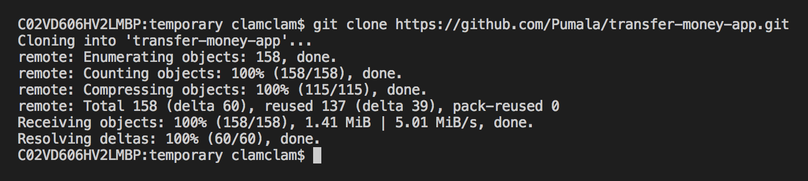
    *Should print **done** when complete.*

2. Go into the directory
  * in the command line type the following and press enter:

    cd transfer-money-app/

    ##### Example Below:
    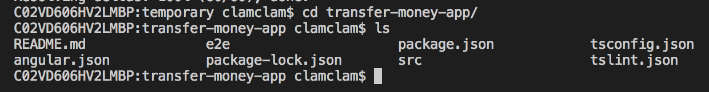
    *Then type **ls** to see the files and folders inside the current directory.*

3. Install dependencies
  * in the command line type the following and press enter:

    install npm

    ##### Example Below:
    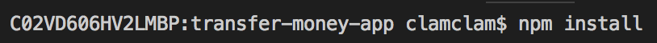
    *If you get an error message, then you may not have node or npm (or both) installed on your computer. Please visit https://www.npmjs.com/get-npm to download them.*

4. Run the application
  * in the command line type the following and press enter:

    npm start
    ##### Example Below:
    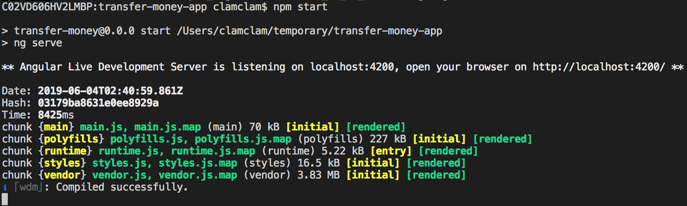
    *Visit http://localhost:4200/ in the browser to view the app.*
### Languages / Frameworks / Technologies used:

* HTML
* CSS / SASS
* Javascript
* Angular 6

### Languages / Frameworks / Technologies used Explanation:

I built this app in Angular 6 because Angular 1.5.x is a version that I don't believe many companies are using. For example, I do not see anyone currently working on a version older than Angular 6 at my current workplace.

So, why not use Angular 7 or even its latest version release of 8?

Actually, I could have gone with Angular 7. Honestly, with each new release since Angular 2 there hasn't been much difference in new features. Ultimately, the reason I didn't choose to build this app in Angular 7 is because I haven't written in Angular 7 yet, and I felt more comfortable tackling this app challenge in a version of Angular I have used before.

The same can also be said for why I didn't go with Angular 8. It is still new, having only been released about a week ago.

## Description

Users can make money transfers, which are then added to a list of recent transactions. Users can type in a search engine to filter the list of recent transactions by the merchant name. Users can also sort the results by date, beneficiary (merchant), and amount in both ascending and descending order.

## Walk Through

####  1. Initial View

  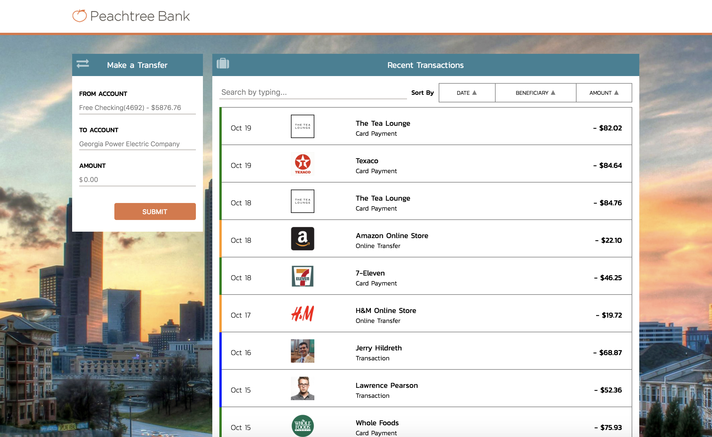

####  2. Make a Transfer

  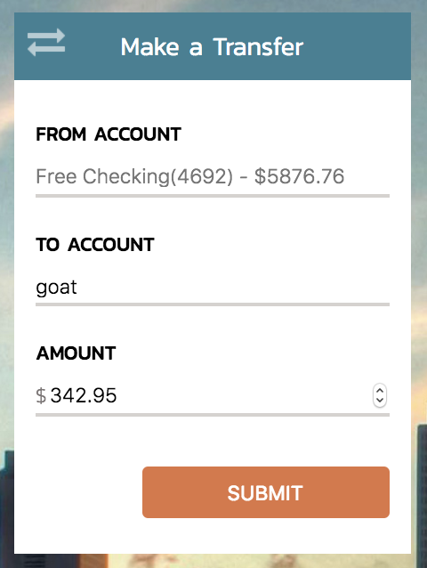

####  3. Transfer is added to the top of the list of recent transactions

  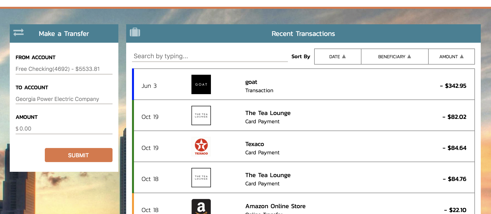

####  4. Filter on 're'

  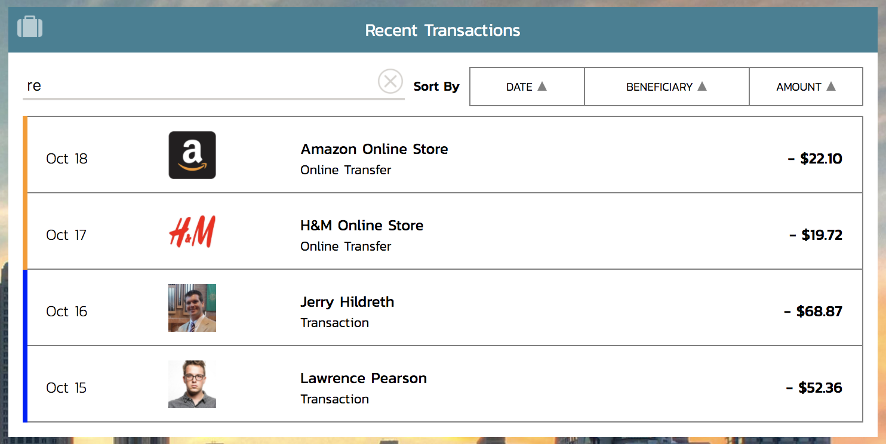

####  5. Sort by Amount Descending

  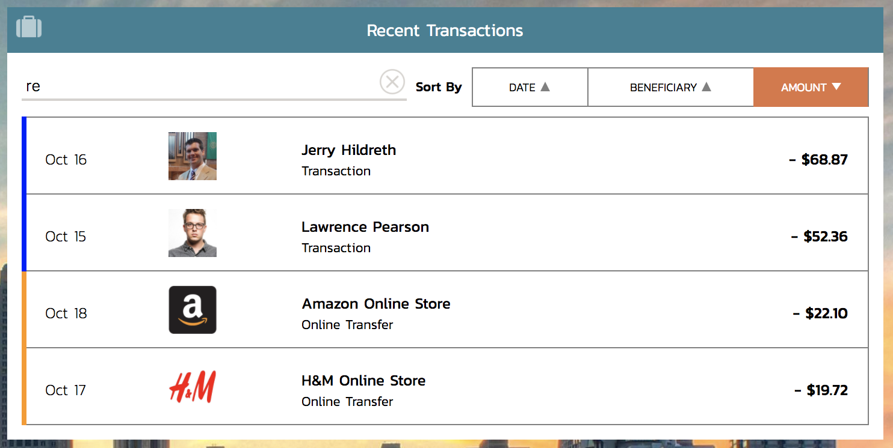

####  6. Sort by Amount Ascending

  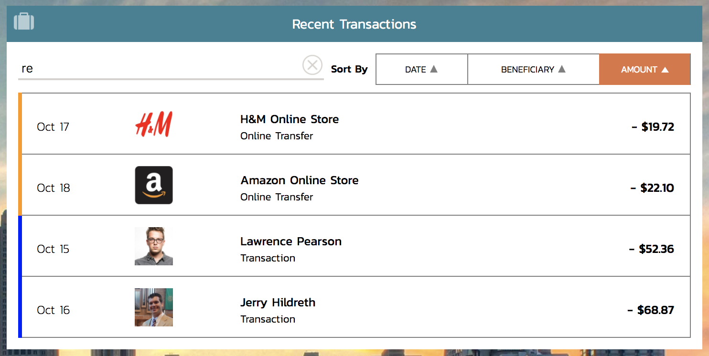

####  7. Sort by Date Descending

  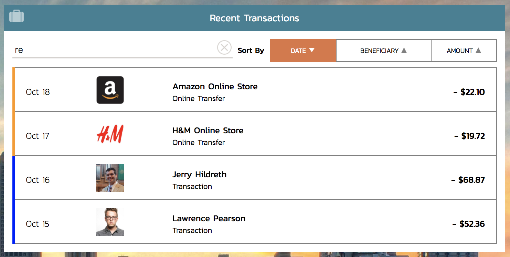

####  8. Sort by Date Ascending

  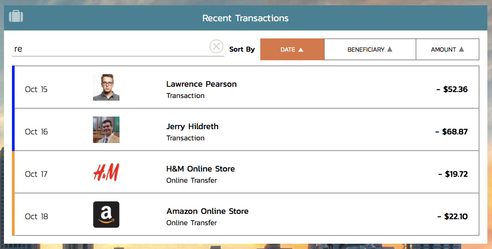

####  9. Sort by Beneficiary Descending

  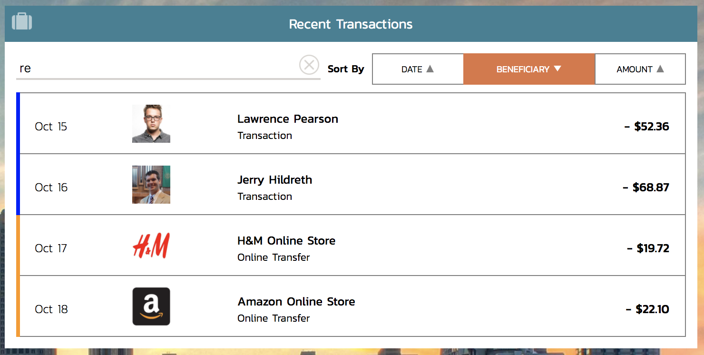

####  10. Sort by Beneficiary Ascending

  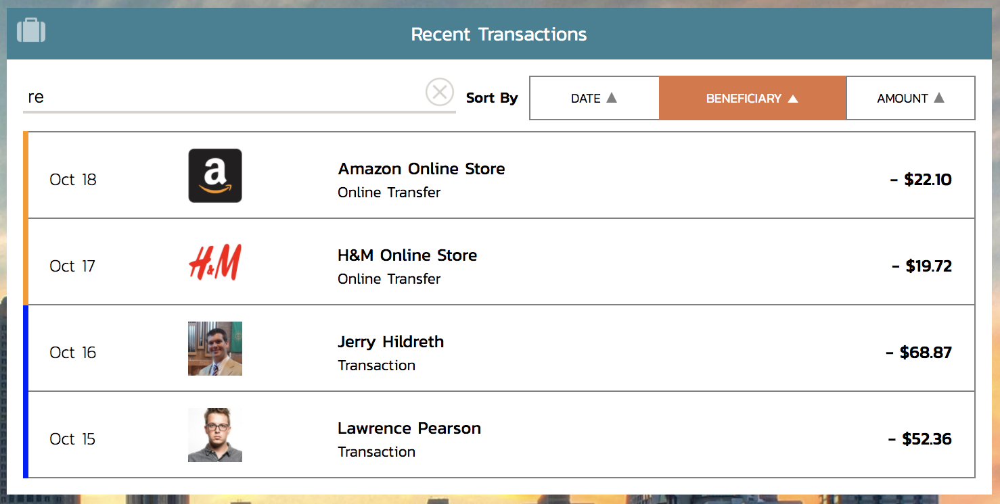

####  11. Clear Filter

  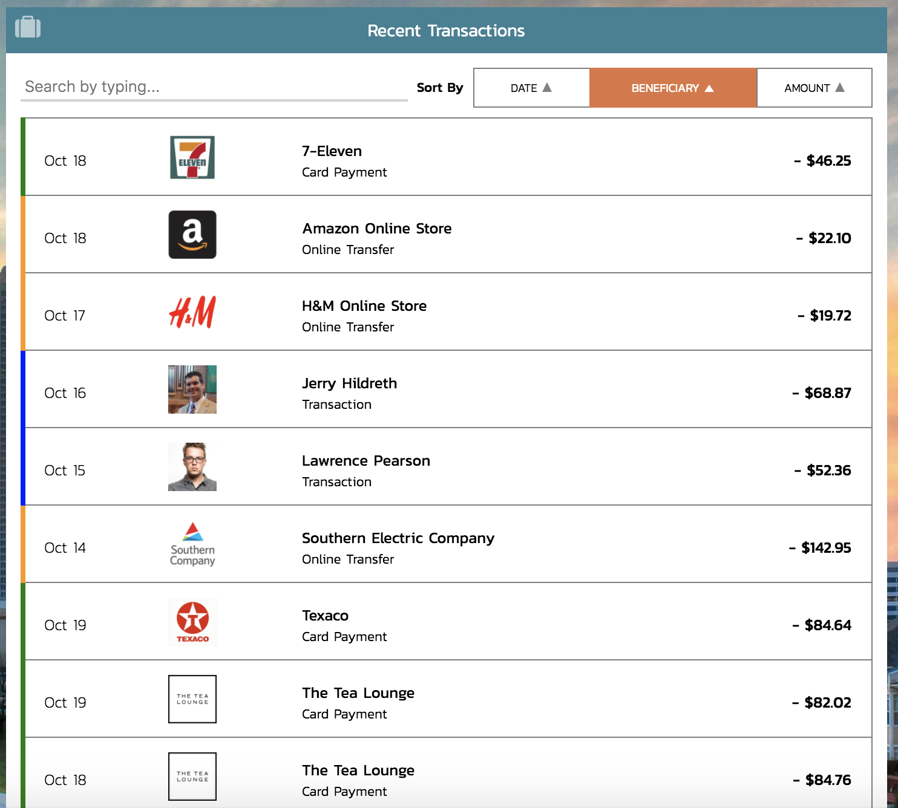

####  12. Return No Results when filter search engine matches nothing

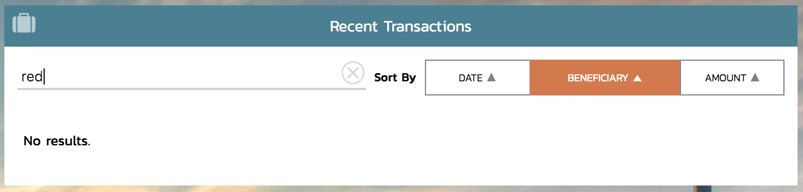

####  13. Exceeds balance error

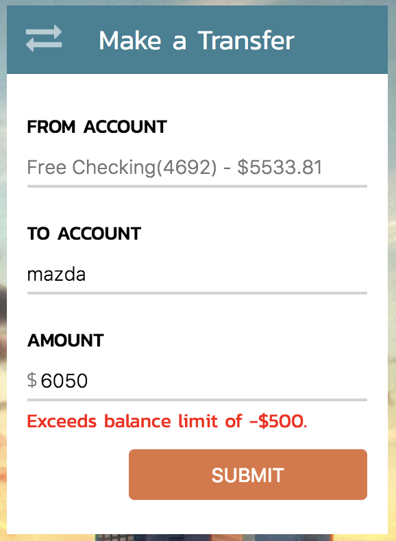
